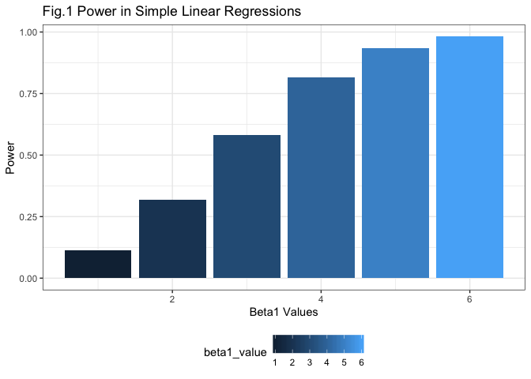

p8105\_hw5\_yw3438
================
Yuning Wang
10/31/2019

## Problem 1

``` r
set.seed(10)

iris_with_missing = iris %>% 
  map_df(~replace(.x, sample(1:150, 20), NA)) %>%
  mutate(Species = as.character(Species)) %>% 
  janitor::clean_names()
```

``` r
replace_measure = function(x) {
  
  if (is.numeric(x)) {
    replace(x, is.na(x), mean(x, na.rm = TRUE))
  } else if (is.character(x)) {
    replace(x, is.na(x), "virginica")
  }
  
}


output = map(iris_with_missing, replace_measure)
output
```

    ## $sepal_length
    ##   [1] 5.100000 4.900000 4.700000 4.600000 5.000000 5.400000 5.819231
    ##   [8] 5.000000 4.400000 4.900000 5.400000 4.800000 5.819231 4.300000
    ##  [15] 5.819231 5.700000 5.400000 5.100000 5.700000 5.100000 5.400000
    ##  [22] 5.100000 4.600000 5.819231 4.800000 5.000000 5.000000 5.200000
    ##  [29] 5.819231 4.700000 4.800000 5.400000 5.200000 5.500000 4.900000
    ##  [36] 5.000000 5.500000 4.900000 4.400000 5.100000 5.000000 4.500000
    ##  [43] 4.400000 5.000000 5.100000 4.800000 5.100000 4.600000 5.300000
    ##  [50] 5.000000 7.000000 6.400000 6.900000 5.500000 6.500000 5.700000
    ##  [57] 6.300000 4.900000 6.600000 5.200000 5.000000 5.900000 6.000000
    ##  [64] 6.100000 5.600000 6.700000 5.600000 5.800000 6.200000 5.600000
    ##  [71] 5.900000 5.819231 6.300000 5.819231 6.400000 6.600000 6.800000
    ##  [78] 6.700000 6.000000 5.700000 5.500000 5.819231 5.800000 6.000000
    ##  [85] 5.400000 5.819231 6.700000 5.819231 5.600000 5.500000 5.500000
    ##  [92] 5.819231 5.800000 5.000000 5.819231 5.700000 5.700000 6.200000
    ##  [99] 5.100000 5.700000 6.300000 5.800000 7.100000 6.300000 6.500000
    ## [106] 7.600000 4.900000 7.300000 6.700000 5.819231 6.500000 5.819231
    ## [113] 6.800000 5.700000 5.800000 6.400000 6.500000 7.700000 7.700000
    ## [120] 6.000000 5.819231 5.600000 7.700000 6.300000 6.700000 7.200000
    ## [127] 6.200000 6.100000 6.400000 7.200000 7.400000 7.900000 6.400000
    ## [134] 5.819231 6.100000 5.819231 5.819231 6.400000 6.000000 6.900000
    ## [141] 6.700000 6.900000 5.819231 6.800000 6.700000 6.700000 6.300000
    ## [148] 6.500000 5.819231 5.900000
    ## 
    ## $sepal_width
    ##   [1] 3.500000 3.000000 3.200000 3.100000 3.600000 3.900000 3.400000
    ##   [8] 3.400000 2.900000 3.100000 3.075385 3.400000 3.075385 3.000000
    ##  [15] 4.000000 4.400000 3.900000 3.500000 3.800000 3.800000 3.400000
    ##  [22] 3.700000 3.600000 3.300000 3.400000 3.000000 3.400000 3.500000
    ##  [29] 3.400000 3.200000 3.100000 3.075385 3.075385 4.200000 3.100000
    ##  [36] 3.200000 3.500000 3.600000 3.000000 3.400000 3.500000 3.075385
    ##  [43] 3.200000 3.500000 3.800000 3.000000 3.800000 3.200000 3.700000
    ##  [50] 3.075385 3.075385 3.200000 3.100000 2.300000 2.800000 2.800000
    ##  [57] 3.300000 2.400000 2.900000 2.700000 2.000000 3.000000 2.200000
    ##  [64] 2.900000 2.900000 3.100000 3.000000 3.075385 2.200000 2.500000
    ##  [71] 3.200000 2.800000 2.500000 2.800000 2.900000 3.000000 2.800000
    ##  [78] 3.075385 3.075385 2.600000 2.400000 2.400000 2.700000 2.700000
    ##  [85] 3.000000 3.400000 3.100000 3.075385 3.000000 2.500000 3.075385
    ##  [92] 3.075385 3.075385 2.300000 2.700000 3.000000 2.900000 2.900000
    ##  [99] 2.500000 2.800000 3.075385 2.700000 3.000000 2.900000 3.075385
    ## [106] 3.000000 2.500000 2.900000 3.075385 3.600000 3.200000 2.700000
    ## [113] 3.000000 3.075385 2.800000 3.200000 3.000000 3.800000 2.600000
    ## [120] 2.200000 3.200000 3.075385 2.800000 2.700000 3.300000 3.200000
    ## [127] 2.800000 3.000000 2.800000 3.000000 2.800000 3.800000 2.800000
    ## [134] 2.800000 3.075385 3.000000 3.400000 3.100000 3.000000 3.100000
    ## [141] 3.100000 3.100000 2.700000 3.200000 3.300000 3.000000 2.500000
    ## [148] 3.000000 3.400000 3.000000
    ## 
    ## $petal_length
    ##   [1] 1.400000 1.400000 1.300000 1.500000 1.400000 1.700000 1.400000
    ##   [8] 1.500000 1.400000 3.765385 1.500000 1.600000 1.400000 3.765385
    ##  [15] 3.765385 1.500000 1.300000 1.400000 1.700000 1.500000 1.700000
    ##  [22] 1.500000 1.000000 3.765385 1.900000 3.765385 1.600000 1.500000
    ##  [29] 1.400000 1.600000 3.765385 1.500000 1.500000 1.400000 3.765385
    ##  [36] 1.200000 1.300000 1.400000 1.300000 1.500000 1.300000 1.300000
    ##  [43] 1.300000 1.600000 1.900000 1.400000 1.600000 3.765385 1.500000
    ##  [50] 1.400000 4.700000 4.500000 4.900000 4.000000 4.600000 4.500000
    ##  [57] 4.700000 3.765385 4.600000 3.900000 3.765385 4.200000 4.000000
    ##  [64] 4.700000 3.600000 4.400000 4.500000 4.100000 4.500000 3.900000
    ##  [71] 4.800000 4.000000 4.900000 3.765385 4.300000 4.400000 4.800000
    ##  [78] 5.000000 4.500000 3.500000 3.800000 3.700000 3.900000 5.100000
    ##  [85] 4.500000 4.500000 4.700000 4.400000 3.765385 4.000000 4.400000
    ##  [92] 4.600000 4.000000 3.300000 4.200000 4.200000 4.200000 4.300000
    ##  [99] 3.000000 4.100000 3.765385 5.100000 5.900000 5.600000 5.800000
    ## [106] 6.600000 4.500000 6.300000 3.765385 3.765385 5.100000 5.300000
    ## [113] 5.500000 5.000000 5.100000 5.300000 3.765385 6.700000 6.900000
    ## [120] 5.000000 5.700000 4.900000 6.700000 4.900000 5.700000 6.000000
    ## [127] 4.800000 4.900000 5.600000 5.800000 6.100000 3.765385 3.765385
    ## [134] 5.100000 5.600000 6.100000 5.600000 5.500000 4.800000 5.400000
    ## [141] 5.600000 5.100000 5.100000 3.765385 3.765385 5.200000 5.000000
    ## [148] 5.200000 5.400000 5.100000
    ## 
    ## $petal_width
    ##   [1] 0.200000 0.200000 0.200000 1.192308 0.200000 0.400000 0.300000
    ##   [8] 0.200000 0.200000 0.100000 0.200000 0.200000 0.100000 0.100000
    ##  [15] 0.200000 0.400000 0.400000 1.192308 0.300000 1.192308 0.200000
    ##  [22] 0.400000 0.200000 0.500000 0.200000 0.200000 0.400000 0.200000
    ##  [29] 0.200000 0.200000 0.200000 0.400000 0.100000 0.200000 0.200000
    ##  [36] 0.200000 0.200000 0.100000 1.192308 0.200000 0.300000 1.192308
    ##  [43] 0.200000 0.600000 0.400000 0.300000 0.200000 0.200000 0.200000
    ##  [50] 0.200000 1.400000 1.500000 1.500000 1.300000 1.500000 1.300000
    ##  [57] 1.600000 1.000000 1.300000 1.400000 1.000000 1.500000 1.192308
    ##  [64] 1.400000 1.300000 1.400000 1.500000 1.000000 1.500000 1.100000
    ##  [71] 1.800000 1.300000 1.500000 1.200000 1.300000 1.400000 1.400000
    ##  [78] 1.192308 1.192308 1.000000 1.100000 1.000000 1.200000 1.600000
    ##  [85] 1.500000 1.600000 1.192308 1.300000 1.192308 1.192308 1.200000
    ##  [92] 1.192308 1.192308 1.192308 1.300000 1.200000 1.300000 1.300000
    ##  [99] 1.192308 1.300000 2.500000 1.900000 2.100000 1.800000 2.200000
    ## [106] 2.100000 1.700000 1.800000 1.800000 2.500000 2.000000 1.900000
    ## [113] 2.100000 2.000000 2.400000 2.300000 1.800000 1.192308 2.300000
    ## [120] 1.500000 1.192308 2.000000 2.000000 1.800000 2.100000 1.800000
    ## [127] 1.800000 1.800000 2.100000 1.600000 1.192308 2.000000 2.200000
    ## [134] 1.500000 1.400000 2.300000 1.192308 1.192308 1.800000 2.100000
    ## [141] 2.400000 2.300000 1.900000 2.300000 2.500000 2.300000 1.900000
    ## [148] 2.000000 2.300000 1.800000
    ## 
    ## $species
    ##   [1] "setosa"     "setosa"     "setosa"     "setosa"     "setosa"    
    ##   [6] "setosa"     "setosa"     "setosa"     "setosa"     "setosa"    
    ##  [11] "setosa"     "setosa"     "setosa"     "setosa"     "setosa"    
    ##  [16] "setosa"     "setosa"     "setosa"     "setosa"     "setosa"    
    ##  [21] "setosa"     "virginica"  "setosa"     "setosa"     "virginica" 
    ##  [26] "setosa"     "virginica"  "setosa"     "setosa"     "setosa"    
    ##  [31] "setosa"     "setosa"     "setosa"     "setosa"     "setosa"    
    ##  [36] "setosa"     "setosa"     "setosa"     "setosa"     "setosa"    
    ##  [41] "setosa"     "virginica"  "setosa"     "setosa"     "setosa"    
    ##  [46] "virginica"  "setosa"     "setosa"     "setosa"     "setosa"    
    ##  [51] "virginica"  "versicolor" "versicolor" "versicolor" "versicolor"
    ##  [56] "versicolor" "virginica"  "versicolor" "virginica"  "versicolor"
    ##  [61] "versicolor" "versicolor" "versicolor" "versicolor" "versicolor"
    ##  [66] "versicolor" "versicolor" "versicolor" "versicolor" "versicolor"
    ##  [71] "versicolor" "virginica"  "versicolor" "versicolor" "versicolor"
    ##  [76] "versicolor" "versicolor" "versicolor" "versicolor" "virginica" 
    ##  [81] "versicolor" "versicolor" "versicolor" "versicolor" "versicolor"
    ##  [86] "versicolor" "versicolor" "versicolor" "versicolor" "versicolor"
    ##  [91] "versicolor" "versicolor" "versicolor" "virginica"  "versicolor"
    ##  [96] "versicolor" "versicolor" "versicolor" "versicolor" "virginica" 
    ## [101] "virginica"  "virginica"  "virginica"  "virginica"  "virginica" 
    ## [106] "virginica"  "virginica"  "virginica"  "virginica"  "virginica" 
    ## [111] "virginica"  "virginica"  "virginica"  "virginica"  "virginica" 
    ## [116] "virginica"  "virginica"  "virginica"  "virginica"  "virginica" 
    ## [121] "virginica"  "virginica"  "virginica"  "virginica"  "virginica" 
    ## [126] "virginica"  "virginica"  "virginica"  "virginica"  "virginica" 
    ## [131] "virginica"  "virginica"  "virginica"  "virginica"  "virginica" 
    ## [136] "virginica"  "virginica"  "virginica"  "virginica"  "virginica" 
    ## [141] "virginica"  "virginica"  "virginica"  "virginica"  "virginica" 
    ## [146] "virginica"  "virginica"  "virginica"  "virginica"  "virginica"

## Problem 2

``` r
# Read in and tidy the filenames into a dataframe
files_name = data.frame(list.files("./data")) 
colnames(files_name) = "file_name"

# Write a function to read in the data of all the files
read_data = function(x) {
  
  read_csv(paste0("./data/", x)) 
  
}

# Save the results in a column in the dataset
file_datas = files_name %>% 
  mutate(data = purrr::map(files_name$file_name, read_data)) %>% 
  unnest()

# Tidy the data
file_data_tidy = file_datas %>% 
  pivot_longer(
    week_1:week_8,
    names_to = "week",
    values_to = "data"
  ) %>% 
  mutate(file_name = str_remove(file_name, ".csv"),
         week = str_remove(week, "week_")) %>% 
  separate(file_name, c("group", "subject_id"), sep = "_") %>% 
  mutate(group = recode(group, "con" = "control", 
                        "exp" = "experimental"))

# Draw a lineplot that reflect
file_data_tidy %>% 
  ggplot(aes(x = week, y = data, 
             color = subject_id, group = subject_id)) + 
  geom_point(alpha = .5) + 
  geom_line() +
  theme_bw() +
  theme(legend.position = "bottom") +
  labs(
    x = "Week",
    y = "Data Value",
    title = "Observations on Each Subject Over Time"
  ) +
  viridis::scale_color_viridis(
    name = "Subject ID", 
    discrete = TRUE
  ) +
  facet_grid(~group)
```

<!-- -->

From the plot above, it can be discovered that in the control group the
data values fluctuated from week 1 to week 8 but the observations’ data
value almost remain the same.

The plot of experimental group shows that the observation data values
gradually and fluctuately increased from week 1 to week 8, which had
difference from the control group.

The two plots showed that the exposure of interest might have a
promotion effect on the subjects.

## Problem 3

Write the function for simple linear regression

``` r
sim_regression = function(n = 30, beta0 = 2, beta1) {
  
  sim_data = tibble(
    x = rnorm(n, mean = 0, sd = 1),
    y = beta0 + beta1 * x + rnorm(n, 0, sqrt(50))
  )
  
  ls_fit = lm(y ~ x, data = sim_data)
  
  ls_tidy = broom::tidy(ls_fit) %>% 
    janitor::clean_names()
  
  tibble(
    beta1_hat = ls_tidy$estimate[[2]],
    p_value = ls_tidy$p_value[[2]]
  )
}
```

Set beta1 = 0. Generate 10000 datasets from the model. Save the results
beta1\_hat and p-value arising from the test of H: beta1 = 0.

``` r
set.seed(10)
#save the results into sim_results
sim_results = 
  rerun(10000, sim_regression(30, 2, 0)) %>% 
  bind_rows() 

head(sim_results)
```

    ## # A tibble: 6 x 2
    ##   beta1_hat p_value
    ##       <dbl>   <dbl>
    ## 1    -2.44   0.0895
    ## 2    -0.366  0.769 
    ## 3     2.10   0.0917
    ## 4    -0.963  0.431 
    ## 5     1.61   0.192 
    ## 6     0.213  0.880

Repeat the process above for beta1 = 1, 2, 3, 4, 5, 6

``` r
sim_results_6 = 
  tibble(beta1_value = c(1, 2, 3, 4, 5, 6)) %>% 
  mutate(
    output_lists = map(.x = beta1_value, 
                       ~rerun(10000, sim_regression(beta1 = .x))),
    estimate_dfs = map(output_lists, bind_rows)) %>% 
  select(-output_lists) %>% 
  unnest(estimate_dfs)

head(sim_results_6)
```

    ## # A tibble: 6 x 3
    ##   beta1_value beta1_hat p_value
    ##         <dbl>     <dbl>   <dbl>
    ## 1           1     1.29   0.291 
    ## 2           1     2.12   0.120 
    ## 3           1     0.702  0.668 
    ## 4           1    -1.35   0.339 
    ## 5           1     1.62   0.175 
    ## 6           1     2.83   0.1000

Make a plot showing the proportion of times the null was rejected (the
power of the test) on the y axis and the true value of beta1 on the x
axis.

``` r
#read in the data
sim_results_6 %>% 
  group_by(beta1_value) %>% 
  mutate(n_sum = n()) %>% 
  # find out all the proportion of beta1 should be rejected
  filter(p_value < 0.05) %>% 
  group_by(beta1_value) %>% 
  mutate(n_reject = n(),
         power = n_reject / n_sum) %>% 
  select(beta1_value, power) %>% 
  distinct() %>% 
  #draw the plot
  ggplot(aes(x = beta1_value, y = power, fill = beta1_value)) +
  geom_col() +
  theme_bw() +
  theme(legend.position = "bottom") +
  labs(
    x = "Beta1 Values",
    y = "Power",
    title = "Fig.1 Power in Simple Linear Regressions"
  ) +
  viridis::scale_color_viridis(
    name = "Beta1 value", 
    discrete = TRUE
  )
```

<!-- -->

From the plot, it can be discovered that as the effect size increases,
the power of the test increases.

The plot showing the relationship between the average estimate of
beta1\_hat and the value of beta1 is as the following one.

``` r
total_mean_tvalue = sim_results_6 %>% 
  group_by(beta1_value) %>% 
  mutate(
    mean_beta1_hat = mean(beta1_hat)
  ) %>% 
  select(beta1_value, mean_beta1_hat) %>% 
  distinct() 
total_mean_tvalue %>% 
  ggplot(aes(x = beta1_value, y = mean_beta1_hat, group = 1)) +
  geom_point(alpha = .8) +
  geom_line() +
  theme_bw() +
  theme(legend.position = "bottom") +
  labs(
    x = "Beta1 Values",
    y = "Average Estimation of beta1-hat",
    title = "Fig.2 Relationship Between Average Estimate of Beta1-hat & Beta1 Value"
  )
```

<!-- -->

The plot showing the average estimate of beta1-hat only in samples for
which the null was rejected on the y axis and the true value of beta1 on
the x axis.

``` r
sim_results_6 %>% 
  group_by(beta1_value) %>% 
  filter(p_value < 0.05) %>% 
  mutate(mean_reject = mean(beta1_hat)) %>% 
  select(-p_value, -beta1_hat) %>% 
  distinct() %>% 
  full_join(total_mean_tvalue) %>% 
  pivot_longer(
    mean_reject:mean_beta1_hat,
    names_to = "type",
    values_to = "mean_value"
  ) %>% 
  ggplot(aes(x = beta1_value,y = mean_value, color = type)) +
  geom_point(alpha = .8) +
  geom_line() +
  theme_bw() +
  theme(legend.position = "bottom") +
  labs(
    x = "Beta1 Values",
    y = "Average Estimation of beta1-hat",
    title = "Fig.3 Relationship Between Average Estimate of Beta1-hat (Rejeced and total) & Beta1 Value"
  ) +
  viridis::scale_color_viridis(
    name = "Type of mean", 
    discrete = TRUE
  )
```

<!-- -->

From the plot, it can be discovered that the sample average of beta1-hat
across tests for which the null is rejected isn’t approximately equal to
the true value of beta1.

Because when the null is rejected, the beta value that we got is
significantly different from the true beta1 value, the mean of the
beta1-hat values must be significantly different from the true beta
value. As a result, the sample average of beta1-hat across tests for
which the null is rejected isn’t approximately equal to the true value
of beta1.
